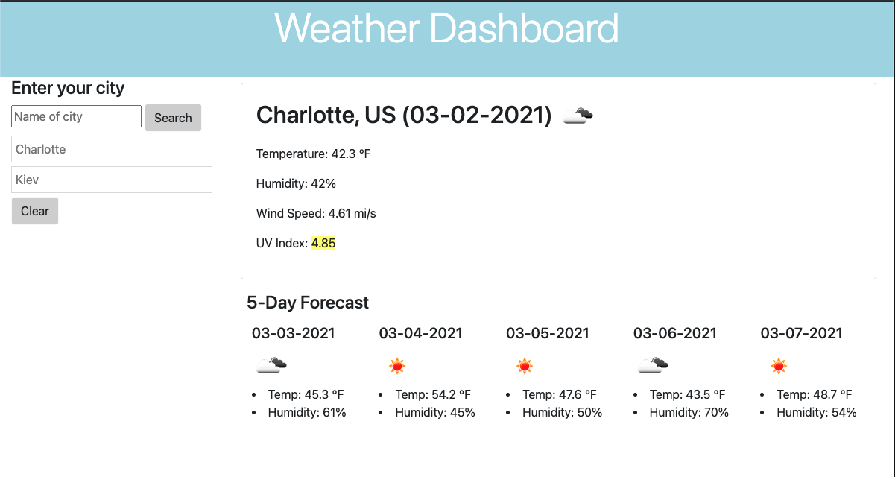
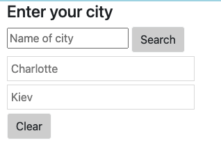

# weather-dashboard
My 6th [repository](https://github.com/vmidor/weather-dashboard) on Github.

# Description

This application was built using Javascript & JQuery, HTML, CSS [Bootstrap 4](https://getbootstrap.com/docs/4.0/getting-started/introduction/), [Moment.js](https://momentjs.com/) and [OpenWeather](https://openweathermap.org). A weather dashboard helps to find forecast in your current location and the location you might go, also you have option to see weathr for the next 5 days.
#

# This project has the following features:
A Search bar for the city location
A card that provides the current weather ** Location, Temp, Humidity, Wind Speed, UV Index
A Card that provides a five day forecast

# Installation
Please visit the deployed project at: https://vmidor.github.io/weather-dashboard/.